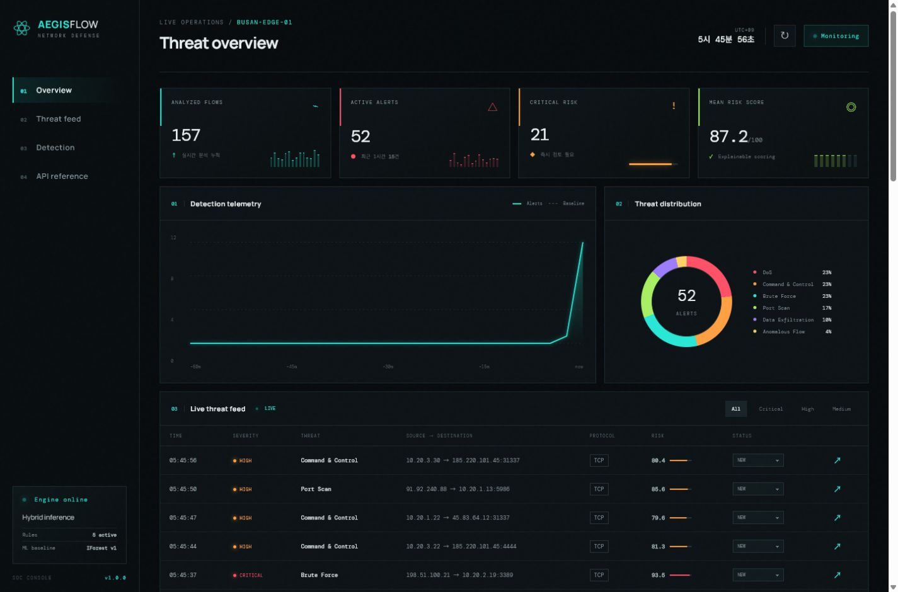
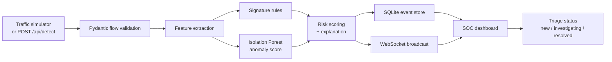

# AegisFlow NIDS

설명 가능한 규칙 탐지와 Isolation Forest 이상 탐지를 결합한 네트워크 흐름 기반 침입탐지 포트폴리오입니다. FastAPI, SQLite, WebSocket으로 수집 → 탐지 → 저장 → SOC 조사 상태 변경까지 하나의 실행 가능한 시스템으로 구성했습니다.

> **범위 안내:** 이 프로젝트는 **flow 기반 NIDS 프로토타입**입니다. Zeek, CICFlowMeter, NetFlow 같은 수집기에서 생성된 네트워크 flow를 분석하는 구조이며, 실제 네트워크 인터페이스에서 패킷을 직접 캡처하거나 방화벽/IPS처럼 트래픽을 차단하는 운영 IDS/IPS 제품은 아닙니다.

  



## 프로젝트 목적

AegisFlow NIDS는 네트워크 보안 직무 포트폴리오를 목표로 만든 **설명 가능한 침입탐지 분석 플랫폼**입니다. 단순히 모델 정확도만 보여주는 프로젝트가 아니라, 보안 이벤트가 생성되고 저장되며 분석가가 조사 상태를 관리하는 흐름까지 구현했습니다.

이 프로젝트가 보여주려는 역량은 다음과 같습니다.

- 네트워크 flow 기반 보안 데이터 모델링
- 규칙 기반 탐지와 비지도 이상탐지의 결합 설계
- 탐지 근거를 남기는 explainable security event 구조
- FastAPI, WebSocket, SQLite를 이용한 실시간 SOC 대시보드 구현
- CICIDS2017 같은 공개 보안 데이터셋으로 확장 가능한 평가 구조

## 핵심 설계

- **하이브리드 탐지:** Port Scan, Brute Force, DoS, Exfiltration, C2 규칙과 정상 흐름 기반 Isolation Forest를 결합합니다.
- **설명 가능성:** 모든 경보에 위험 점수, 모델 이상 점수, 일치 규칙과 사람이 읽을 수 있는 근거를 남깁니다.
- **운영 흐름:** SQLite 이벤트 이력, `new → investigating → resolved` 조사 상태, 실시간 WebSocket 피드를 제공합니다.
- **안전한 데모:** 관리자 권한이나 원시 패킷 캡처 없이 결정론적 트래픽 시뮬레이터로 즉시 시연할 수 있습니다.
- **실데이터 확장:** CICIDS2017의 `BENIGN` flow CSV로 정상 기준 모델을 다시 학습할 수 있습니다.

## 아키텍처



## 마린웍스 지원 직무와의 연결성

마린웍스 지원용 포트폴리오 관점에서 이 프로젝트는 **네트워크 보안, 침입탐지, 보안 데이터 분석, AI 기반 이상징후 탐지** 역량을 보여주는 데 초점을 맞췄습니다.

| 직무 키워드 | 프로젝트에서 보여주는 근거 |
|---|---|
| 네트워크 보안 | flow 필드, 포트, 프로토콜, 연결 수, SYN 수 기반 탐지 |
| 침입탐지 | Port Scan, Brute Force, DoS, Exfiltration, C2 규칙 |
| AI/ML 이상탐지 | 정상 baseline 기반 Isolation Forest |
| 보안 운영 | 실시간 대시보드, 이벤트 저장, 조사 상태 변경 |
| 설명 가능성 | rule id, anomaly score, risk score, evidence 제공 |

## 빠른 실행

```powershell
python -m venv .venv
.\.venv\Scripts\python.exe -m pip install -r requirements.txt
.\.venv\Scripts\python.exe -m uvicorn app.main:app --reload --port 8000
```

브라우저에서 `http://127.0.0.1:8000`을 열면 대시보드가 표시됩니다. API 계약은 `http://127.0.0.1:8000/docs`에서 확인할 수 있습니다.

## API 예시

```powershell
$body = @{
  src_ip = "185.220.101.45"; dst_ip = "10.20.1.10"
  src_port = 50111; dst_port = 443; protocol = "TCP"
  duration_ms = 1200; packets = 220; bytes_total = 120000
  tcp_syn_count = 90; failed_logins = 0
  connections_last_minute = 300; unique_ports_last_minute = 55
} | ConvertTo-Json

Invoke-RestMethod -Method Post -Uri http://127.0.0.1:8000/api/detect -ContentType application/json -Body $body
```

## CICIDS2017 재학습

UNB에서 CICIDS2017 MachineLearningCSV 파일을 받은 뒤 다음과 같이 실행합니다. 원본 데이터는 크기·라이선스·재현성 때문에 저장소에 포함하지 않습니다.

```powershell
.\.venv\Scripts\python.exe scripts/train.py --csv "data/raw/Friday-WorkingHours-Afternoon-DDos.pcap_ISCX.csv"
```

현재 어댑터는 BENIGN 레코드의 flow duration, forward packets/bytes, destination port, SYN flag를 사용하고 운영 문맥 피처는 중립값으로 채웁니다. 실제 배포에서는 CICFlowMeter/Zeek의 동일한 집계 창을 학습과 추론 양쪽에 고정해야 합니다.

## CICIDS2017 평가

라벨이 포함된 CICIDS2017 MachineLearningCSV 파일이 있으면 현재 탐지기의 이진 탐지 성능을 간단히 확인할 수 있습니다.

```powershell
.\.venv\Scripts\python.exe scripts/evaluate_cicids.py --csv "data/raw/Friday-WorkingHours-Afternoon-DDos.pcap_ISCX.csv" --limit 50000
```

이 평가는 `BENIGN`을 정상, 그 외 라벨을 공격으로 보고 precision, recall, F1, false positive rate를 계산합니다. 단, 같은 날짜/호스트 패턴이 train/test에 섞이면 누수가 생길 수 있으므로 최종 성능 주장에는 날짜 또는 호스트 단위 holdout 평가가 필요합니다.

## 검증

```powershell
.\.venv\Scripts\python.exe -m pytest -q
.\.venv\Scripts\python.exe -m compileall app scripts
```

테스트는 다섯 공격 규칙, 정상 흐름, 입력 검증, 이벤트 보존 한도, 조사 상태 변경, 메트릭, API 계약을 검증합니다.

## 프로젝트 구조

```text
app/
  detector.py       # 피처화, 규칙, Isolation Forest, 위험 점수
  storage.py        # SQLite 이벤트 저장 및 집계
  simulator.py      # 안전한 라이브 흐름 생성기
  main.py           # FastAPI / WebSocket / 정적 대시보드
  static/           # SOC 운영 UI
scripts/train.py    # 합성 기준 또는 CICIDS2017 정상 흐름 학습
scripts/evaluate_cicids.py # CICIDS2017 라벨 CSV 기반 간이 이진 평가
tests/              # 탐지·저장소·API 자동 테스트
docs/               # 인터뷰 기반 설계와 검증 근거
```

## 면접에서 설명할 핵심 포인트

- 실제 패킷 차단기가 아니라 flow 기반 NIDS 프로토타입으로 범위를 좁힌 이유
- 알려진 공격은 규칙으로 설명 가능성을 확보하고, 알려지지 않은 흐름은 Isolation Forest로 보완한 이유
- risk score는 보정된 공격 확률이 아니라 SOC triage 우선순위 점수라는 점
- CICIDS2017 평가에서는 임의 행 분할 대신 날짜/호스트 단위 holdout이 필요하다는 점
- 운영 환경 확장 시 인증, TLS, CORS allowlist, rate limit, 감사 로그, 메시지 브로커가 필요하다는 점

## 명확한 한계

이 프로젝트는 포트폴리오용 **flow 기반 NIDS 프로토타입**이며 방화벽/IPS처럼 패킷을 차단하지 않습니다. 합성 시뮬레이터의 결과는 실제 운영 성능을 뜻하지 않습니다. 실제 성능 주장은 시간/호스트 단위 데이터 분할, 클래스별 precision·recall·F1, false positives per hour, 처리량과 지연 측정을 거친 뒤에만 가능합니다.

설계 결정과 전문가 질문–답변 기록은 [docs/DESIGN_INTERVIEW.md](docs/DESIGN_INTERVIEW.md), 운영·위협 모델은 [docs/ARCHITECTURE.md](docs/ARCHITECTURE.md), 면접 방어 포인트는 [docs/INTERVIEW_NOTES.md](docs/INTERVIEW_NOTES.md), 평가 계획은 [docs/EVALUATION_PLAN.md](docs/EVALUATION_PLAN.md)를 참고하세요.
